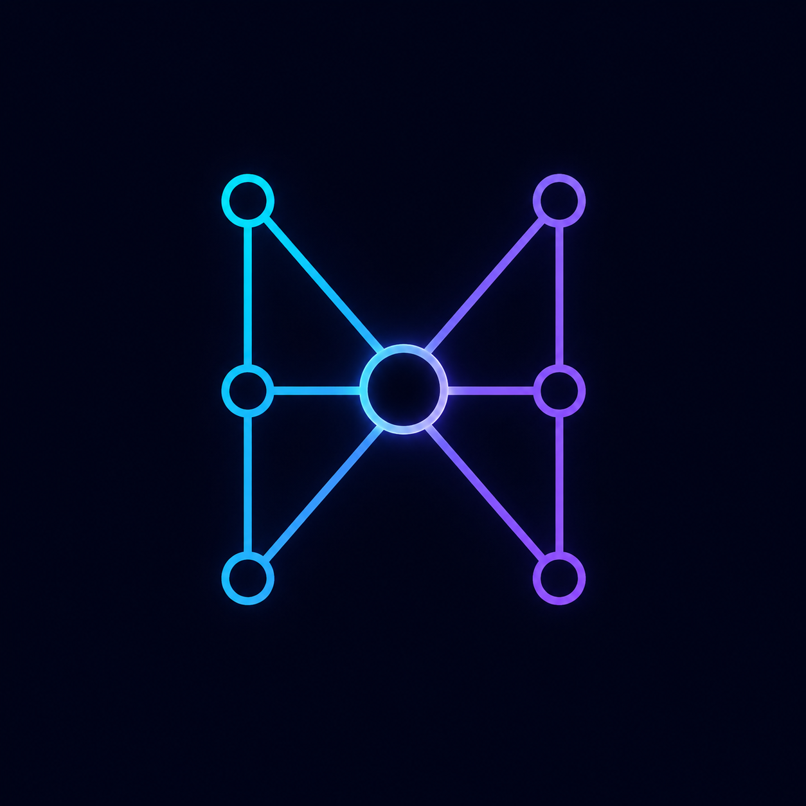
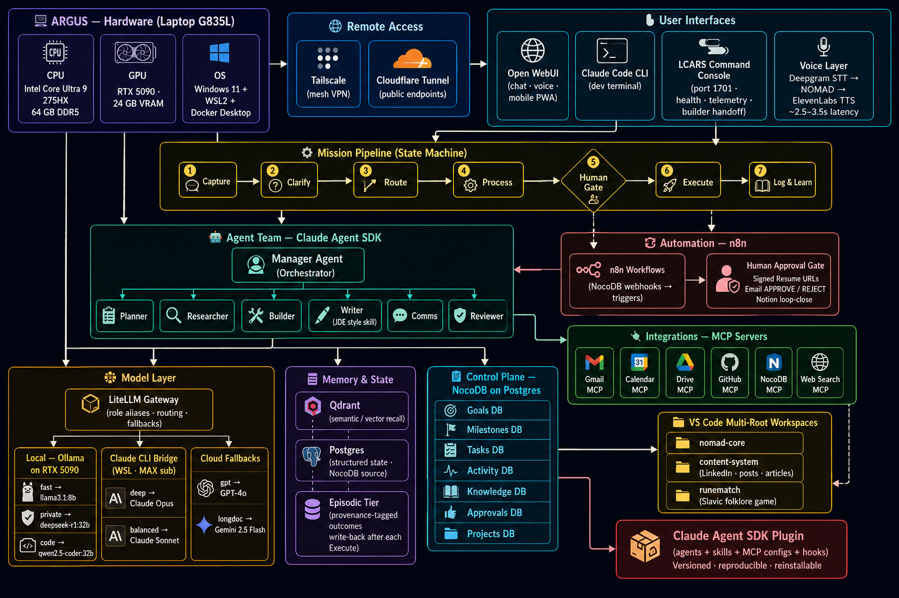

<p align="center">
  
</p>

<h1 align="center">Project NOMAD</h1>
<p align="center"><b>Networked Operations &amp; Management Assistant for Decisions</b></p>

---

NOMAD is a personal AI orchestrator plus an autonomous multi-agent team that runs projects
end-to-end. A manager agent delegates to lane specialists (comms, research, dev, support, ads)
who work across email, calendar, docs, code, web, and image generation. **Agents act
autonomously on anything reversible but pause for human approval on irreversible/external
actions** — send email, merge to main, publish, share externally, spend, delete.

## Architecture



The orchestration is an **explicit state machine** (the "mission pipeline"):

```
Capture → Clarify → Route → Process → Human Gate → Execute → Log & Learn
```

- **Capture/Clarify/Route** — a goal enters, is clarified, and is routed to a lane specialist.
- **Process** — the specialist drafts an action proposal (research-lane Process can ground the
  draft in live web data first; that fetch is read-only and pre-gate).
- **Human Gate** — the run **pauses**. Nothing irreversible runs until a human approves. Resume
  is push-based (Postgres `LISTEN/NOTIFY` ~0.2s) with a poller as a fail-open backup.
- **Execute → Log & Learn** — on approval the action runs, then a provenance record is written
  back so future routing is informed by past outcomes.

## Working model — one platform, many projects

NOMAD is the **hub**; each of my projects is a **spoke** that *consumes* the platform's services
without owning them.

```
        ┌──────────────────────────────┐
        │   NOMAD platform (this repo)  │   ← single owner of all services,
        │   engine · gateway · gate ·   │     resources, and the approval gate
        │   MCP tools · voice · memory  │
        └──────────────┬───────────────┘
            read-only capabilities, declared per project
       ┌────────────┬──┴───────────┬────────────┐
   project-a/    project-b/     project-c/    …            ← my projects, one folder in WSL2
   Nomad.md      Nomad.md       Nomad.md                     each carries a Nomad.md marker
```

In practice:

- **All projects live in one folder under WSL2**, each its own git repo. I work on one at a time
  by opening **its own VS Code window** in WSL — normal per-project editing, with Claude Code /
  agents scoped to that repo.
- **Every project carries a [`Nomad.md`](Nomad.md) marker** at its root. It declares the project
  to the platform (name, status, lane, stack) **and** documents which NOMAD capabilities the
  project may use and how to reach them (the LiteLLM gateway, the v2 engine, the MCP tools, the
  approval gate, voice, memory…). Drop a `Nomad.md` into any repo and it joins the platform.
- **NOMAD discovers projects from those markers.**
  [`nomad-console/sync_projects.py`](nomad-console/sync_projects.py) scans the project roots,
  reads each `Nomad.md`, and upserts it into mission control — so the cockpit/console shows every
  project's status in one place. *(The status UI is a work in progress.)*
- **It's a read-only / centralized model.** Projects **use** NOMAD's capabilities but never
  **modify** them. This repo is the single source of truth for the platform: all services,
  resources, and the gate live and change here. A project can *call* NOMAD; it can't reconfigure
  it.
- **Updates flow one way.** When the platform changes, I refresh the `Nomad.md` files in the
  projects so each one's declared capabilities stay in sync with what NOMAD actually offers.

> The `Nomad.md` in *this* repo is NOMAD describing itself; the same marker in a consumer repo
> describes that project plus the platform surface it's allowed to use.

## Repository map

| Path | What it is | Docs |
|---|---|---|
| [`v2/`](v2/) | **The v2 pipeline engine** — state machine, lane specialists, skills, MCP tools, tests | [README](v2/README.md) |
| [`nomad-console/`](nomad-console/) | Operator dashboard (LCARS UI): telemetry, projects, agents, chat, voice | [README](nomad-console/README.md) |
| [`crew/`](crew/) | v1 CrewAI agent team + the engineering crew that builds NOMAD itself | [README](crew/README.md) |
| [`dispatcher/`](dispatcher/) | Builder handoff (headless Claude Code in a repo) + interactive terminal daemon | [README](dispatcher/README.md) |
| [`mcp-local/`](mcp-local/) | Local MCP servers (local-LLM bridge, scraper, image gen) | [README](mcp-local/README.md) |
| [`nomad-plugin/`](nomad-plugin/) | NOMAD packaged as a Claude Code plugin (agents + skills + MCP + hooks) | [README](nomad-plugin/README.md) |
| [`nomad-voice/`](nomad-voice/) | On-device speech: Piper TTS + faster-whisper STT | [README](nomad-voice/README.md) |
| [`nomad-scraper/`](nomad-scraper/) | LLM-driven web scrape/search (ScrapeGraphAI) | [README](nomad-scraper/README.md) |
| [`claude-bridge/`](claude-bridge/) | OpenAI-compatible shim that answers via the local `claude` CLI | [README](claude-bridge/README.md) |
| [`litellm/`](litellm/) | Model-gateway routing config (role aliases → real models) | [README](litellm/README.md) |
| [`n8n/`](n8n/) | Automation + approval-gate workflow templates | [README](n8n/README.md) |
| [`notion/`](notion/) | Optional Notion mission-control schema + setup (rollback/mirror data layer) | [README](notion/README.md) |

Companion docs: **[CLAUDE.md](CLAUDE.md)** (context for AI coding agents) ·
**[AGENTS.md](AGENTS.md)** (build/test/guardrail rules) ·
**[NOMAD_Orchestrator_Architecture.md](NOMAD_Orchestrator_Architecture.md)** (full design).

## The stack

| Layer | Tech |
|---|---|
| Engine / services | Python 3.11 · FastAPI · uvicorn |
| Orchestration | Docker Compose |
| Data / control plane | Postgres + NocoDB (mission control: projects, goals, milestones, tasks, activity, approvals, knowledge) |
| Memory | Qdrant (semantic recall) |
| Model gateway | LiteLLM (role aliases: `deep` `balanced` `gpt` `longdoc` `fast` `private` `code`) |
| Local models | Ollama (on the GPU) |
| Automation / gates | n8n |
| Chat UI | Open WebUI (chat · voice · mobile PWA) |

> **Models are addressed by role alias, never by raw model name.** Swap the underlying model in
> [`litellm/config.yaml`](litellm/config.yaml) only. Cloud aliases fall back to a local Ollama
> model, so NOMAD never goes dark if a provider is throttled or offline.

## Quick start

```bash
cp .env.example .env          # then fill in keys — see the comments in the file
docker compose up -d          # bring up the whole stack

# Or just the v2 engine (cockpit + API at 127.0.0.1:8099):
docker compose up -d nomad-v2-engine
```

Key local endpoints once up:

| Service | URL | Purpose |
|---|---|---|
| v2 engine / cockpit | http://127.0.0.1:8099 | The mission pipeline + human gate |
| Operator console (LCARS) | http://127.0.0.1:1701 | Telemetry, projects, chat, voice |
| Open WebUI | http://localhost:3000 | Talk to every model |
| LiteLLM gateway | http://localhost:4000 | The model router |
| n8n | http://localhost:5678 | Integrations & approval gate |
| NocoDB | http://localhost:8095 | Mission-control data |
| Qdrant | http://localhost:6333 | Vector memory |

See each module's README for service-specific setup. v2 tests are plain Python scripts (no
pytest harness) — see [`v2/README.md`](v2/README.md) and [`AGENTS.md`](AGENTS.md).

## How autonomy + approvals work

- Agents act freely on anything **reversible** (drafts, research, internal notes, uncommitted
  code edits, mission-control updates).
- For **irreversible/external** actions the run pauses at the **Human Gate**. The operator
  approves/rejects (in the cockpit, in NocoDB, or via a signed email link from n8n) → only then
  does Execute run. **Defense in depth:** a Claude Code harness hook (`.claude/hooks/guard.py`)
  independently guards irreversible Execute actions even if the app-layer gate is bypassed.
- Trusted action-types can be promoted toward auto later by relaxing the gate — deliberately, per
  type.

## Security

- Real secrets live only in `.env` (git-ignored). Never commit keys. The committed
  `.env.example` and n8n workflow JSONs contain only placeholders.
- Keep services on `localhost` / Tailscale; don't expose ports to the public internet. The
  console binds to `127.0.0.1` and fails closed (requires Basic Auth) for any proxied/tunnelled
  request.

## Status & caveats

NOMAD is a personal/operator project, not a turnkey product. Before relying on it, verify:

- Exact model strings in [`litellm/config.yaml`](litellm/config.yaml) against current provider docs.
- Ollama model tags against [ollama.com/library](https://ollama.com/library) (tags drift).
- That you've wired credentials into the n8n approval-gate nodes (the JSONs ship as templates).

## License

[MIT](LICENSE) © 2026 Josias De Lima — ITNomadLab.
